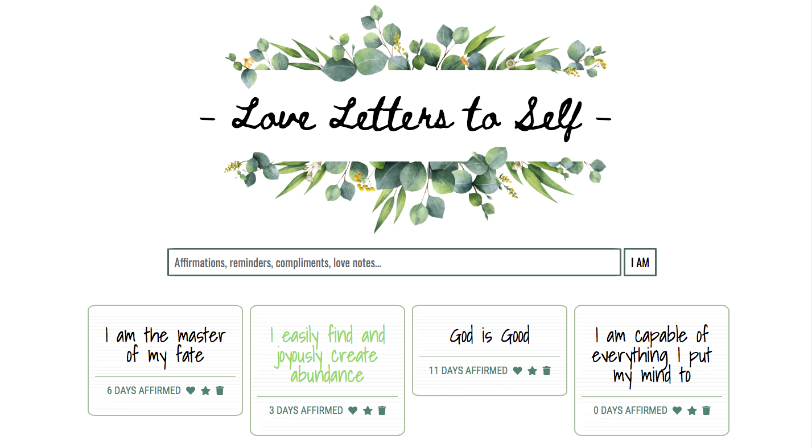

# Love Letters Express App

### Goal: Create an app where users can post love letters to Self, daily affirmations, and reminders.

## Design and Development:
**Tech Used** HTML, CSS, JavaScript, Node, Express, EJS template, MongoDB:
Using Node, Express, JS, and MongoDB to store and access data, this app allows users to write notes to themselves. Through the PUT method, they can favorite notes which will change the color of the notes and keep track of how many days they've read the affirmations.

## Reflections:
I loved being able to build an app I would actually use and would better my life every day.

## Installation
1. Clone repo
2. run `npm install`

## Usage
1. run `node server.js`
2. Navigate to `localhost:<####>`
